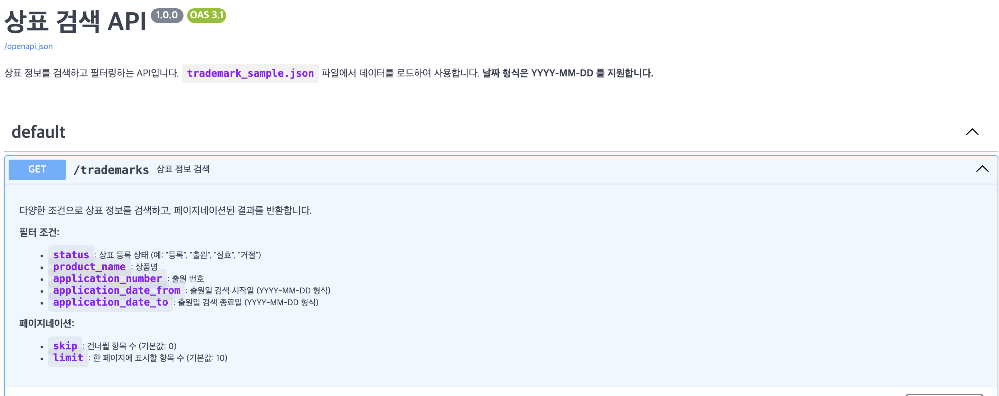

# 간단한 상표 검색 API 구현 

## 1. 프로젝트 소개
   - 이 프로젝트는 FastAPI를 사용하여 구현한 간단한 상표 정보 검색 API입니다.
   - 주어진 `trademark_sample.json` 데이터를 기반으로 사용자가 원하는 상표 정보를 다양한 조건으로 필터링하여 조회할 수 있는 기능을 제공합니다.

## 2. 주요 기능
   - 상표 정보 다중 조건 필터링 검색 (GET /trademarks)
     - 출원 번호 (applicationNumber) 일치 검색
     - 상표명 (productName) 부분 일치 검색 (대소문자 구분 없음)
     - 등록 상태 (registerStatus) 일치 검색 (대소문자 구분 없음)
     - 출원일 (applicationDate) 기준 범위 검색 (YYYY-MM-DD 형식 입력)
       - `application_date_from`: 특정 날짜 이후 출원된 상표 검색
       - `application_date_to`: 특정 날짜 이전 출원된 상표 검색
   - 페이지네이션 (결과 건너뛰기 `skip`, 결과 개수 제한 `limit`)

## 3. API 명세 (API Specification)
   - 이 API는 FastAPI의 자동 생성 문서를 통해 더욱 자세한 명세를 확인할 수 있습니다.
   - 서버 실행 후 `http://127.0.0.1:8000/docs` 로 접속하여 대화형 API 문서를 사용해보세요.
   - 
     예: 
   - 주요 엔드포인트:
     - **GET /trademarks**
       - 설명: 다양한 조건으로 상표 정보를 검색하고, 페이지네이션된 결과를 반환합니다.
       - 쿼리 매개변수:
         - `application_number` (str, optional): 출원 번호
         - `product_name` (str, optional): 상표명 검색어
         - `status` (str, optional): 등록 상태 (예: "등록", "출원", "거절", "실효")
         - `application_date_from` (date, optional): 검색 시작 출원일 (형식: YYYY-MM-DD)
         - `application_date_to` (date, optional): 검색 종료 출원일 (형식: YYYY-MM-DD)
         - `skip` (int, optional, default: 0): 건너뛸 결과 수
         - `limit` (int, optional, default: 10): 반환할 결과 수
       - 응답 모델: `List[Trademark]` (상세 구조는 아래 Pydantic 모델 참조 또는 /docs 확인)

## 4. 실행 방법
   1. **Python 환경 설정**:
      - Python 3.8 이상 
   2. **필요 라이브러리 설치**:
        ```bash
        pip install fastapi uvicorn pydantic
        ```
   3. **데이터 파일 준비**:
      - 프로젝트 루트 디렉토리에 제공된 `trademark_sample.json` 파일을 위치시킵니다.
   4. **FastAPI 서버 실행**:
      - 프로젝트 루트 디렉토리에서 다음 명령어를 실행합니다.
        ```bash
        uvicorn main:app --reload
        ```
        (여기서 `main`은 파이썬 파일명, `app`은 FastAPI 인스턴스명입니다.)
   5. **API 접속 및 테스트**:
      - 웹 브라우저 또는 API 테스트 도구를 사용하여 아래 주소로 접속합니다.
        - API 문서 (Swagger UI): `http://127.0.0.1:8000/docs`
        - API 문서 (ReDoc): `http://127.0.0.1:8000/redoc`
        - 예시 API 호출: `http://127.0.0.1:8000/trademarks?status=등록&limit=5`

## 5. 기술적 의사결정 및 설명
   - **프레임워크 선택**: Python 기반의 `FastAPI`를 사용했습니다. 
     - 이유: 현대적이고 빠른 성능, 자동 API 문서 생성, Pydantic을 통한 강력한 데이터 유효성 검사, Python 타입 힌트 기반의 직관적인 개발 경험이 장점이라고 판단했습니다. 특히 짧은 시간 내에 API를 개발하고 테스트하는 데 매우 효율적이었습니다.
   - **데이터 처리 및 저장**:
     - 애플리케이션 시작 시(`lifespan` 이벤트 사용) `trademark_sample.json` 파일을 읽어 메모리에 로드하고, 각 데이터를 `Trademark` Pydantic 모델 객체로 변환하여 리스트 형태로 저장했습니다.
     - 이유: API 요청 시마다 파일을 읽는 오버헤드를 줄이고, Pydantic 객체를 사용함으로써 타입 안정성, 데이터 유효성 검증, 필드 값 자동 변환(예: 날짜 문자열 -> `date` 객체)의 이점을 얻고자 했습니다. 이를 통해 필터링 로직 등에서 데이터를 더 안전하고 편리하게 다룰 수 있었습니다.
   - **Pydantic 모델 (`Trademark`) 설계**:
     - 과제 요구사항의 '데이터셋 컬럼 정의' 를 기반으로 각 필드의 타입을 지정했습니다.
     - `Optional` 타입을 사용하여 결측치(`null` 값)를 처리했고 , `List` 타입을 사용하여 배열 형태의 데이터를 처리했습니다. 
     - `applicationNumber` 필드는 데이터의 고유 식별자로 판단하여 필수 필드로 설정하고, `lifespan`에서 로드 시 해당 필드가 없는 데이터는 제외하도록 처리했습니다. (이 부분은 사용자님의 최종 판단을 적어주세요!)
     - 날짜 형식 문자열("YYYYMMDD")을 Python의 `date` 객체로 변환하기 위해 `@field_validator`를 사용하여 커스텀 validator를 구현했습니다. 이를 통해 날짜 기반의 범위 검색 등을 용이하게 했습니다.
   - **API 엔드포인트 설계**:
     - 단일 엔드포인트 (`GET /trademarks`)에서 다양한 쿼리 매개변수를 통해 복합적인 필터링 및 페이지네이션이 가능하도록 설계했습니다. 이는 RESTful API 설계 원칙을 따르면서도 사용 편의성을 높이기 위함입니다.
   - **필터링 로직**:
     - 핵심 필터링 로직은 별도의 헬퍼 함수(`filter_trademarks_data`)로 분리하여 API 핸들러 함수의 가독성을 높이고 로직의 재사용 가능성을 고려했습니다.
     - 문자열 검색(상표명) 시에는 `.lower()`를 사용하여 대소문자를 구분하지 않도록 처리하여 사용자 편의성을 높였습니다.

## 6. 문제 해결 과정에서 고민했던 점
   - **날짜 및 리스트 필드 처리**: 초기 Pydantic 모델 설계 시, JSON 데이터 내 다양한 날짜 형식(단일 값, 리스트 내 값, null)과 리스트 필드를 `date` 객체 및 Python 리스트로 정확히 변환하고 유효성을 검증하는 과정에서 많은 고민과 디버깅을 거쳤습니다. `@field_validator`를 활용하여 이 문제를 해결했습니다.
   - **쿼리 매개변수 이름 일치 문제**: API 호출 시 URL의 쿼리 매개변수 이름과 FastAPI 함수의 매개변수 이름이 대소문자까지 정확히 일치해야 필터링이 정상 동작한다는 점을 디버깅 과정에서 다시 한번 상기했습니다. (예: `applicationnumber` vs `application_number`)

## 7. 개선하고 싶은 부분
   - **보다 다양한 필터링 옵션 추가**: 상품 유사군 코드(`asignProductSubCodeList`), 비엔나 코드(`viennaCodeList`) 등 더 많은 필드에 대한 필터링 기능 추가.
   - **검색 결과 정렬 기능**: 특정 필드(예: 출원일 최신순, 상품명 가나다순)를 기준으로 검색 결과를 정렬할 수 있는 기능 추가.
   - **고급 검색 기능**:
     - 키워드가 정확하게 일치하지 않더라도 사용자가 원하는 결과를 찾을 수 있는 방법
        - R-Trie와 같은 자료구조를 활용하여 접두사 기반 검색 성능을 향상시키거나 자동완성기능 추가.
   - **데이터베이스 연동**: 현재는 JSON 파일을 메모리에 로드하여 사용하지만, "데이터가 대량(예: 10만 건 이상)으로 늘어났을 경우의 확장성" 을 고려하여 PostgreSQL, MySQL 등의 관계형 데이터베이스 도입.

---